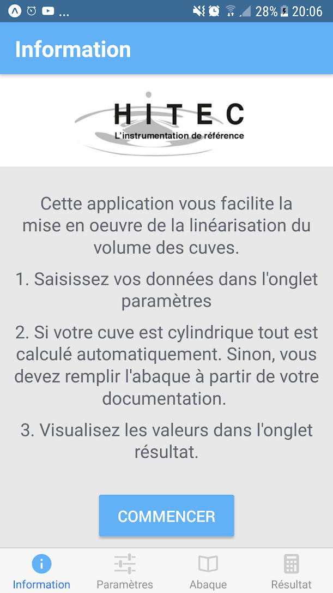
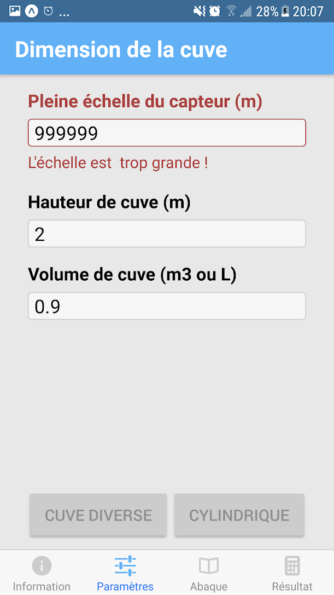
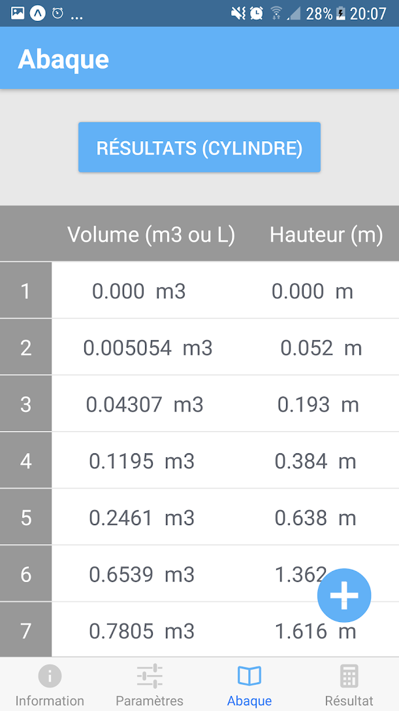
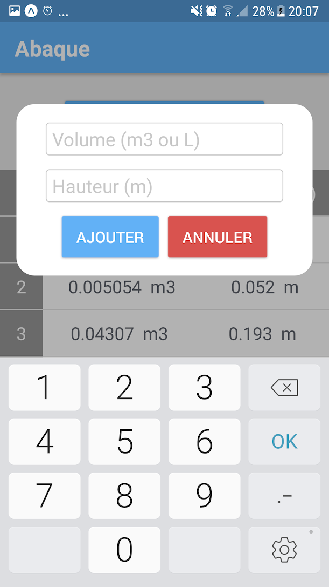
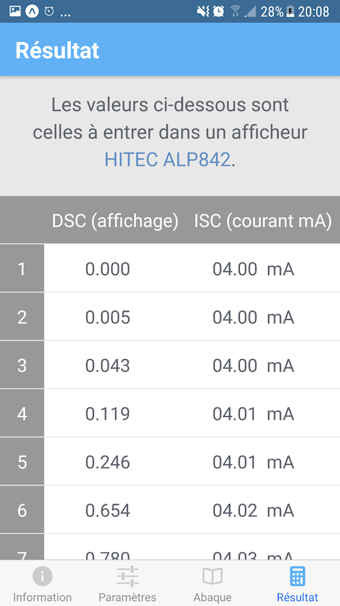

# Hitec - Linearization of tank volumes

[Available on Playstore](https://play.google.com/store/apps/details?id=fr.hitec.linearisation).

A react native application, done as a freelance for the company [Hitec](https://hitec.fr/).

Calculates the position of pressure sensors based on user measurements.

<table> 
  <tr>
    <td></td>
    <td></td>
    <td></td>
  </tr>
  
  <tr>
    <td></td>
    <td></td> 
  </tr>
 </table>  

* React Native App 
* Both Ios and Android 
* Build with expo

## Dependenties

* [expo](https://expo.io/tools#xde) - [XDE (graphic interface)](https://github.com/expo/xde/releases)
* [node.Js](https://nodejs.org/en/)

Not mandatory (emulator)

* [genymotion](https://www.genymotion.com/desktop/)
* [android studio](https://developer.android.com/studio/)
* Xcode (only on mac)

## Getting started

* `git clone https://github.com/grachet/react-linearization-app.git`
* `npm i`
* `run expo XDE (or command line : $ exp start)`
* `choose share and scan QR code with a real device` 
* for simulator use genymotion or android studio
or xcode (not always easy to configure)

## Build executable for stores

* `exp build:android` or `exp build:ios` in folder root
* download app from the link displayed in console 
* add it in [google play console](https://play.google.com/apps/publish/)

## React Native Module

* [tcomb-form-native](https://github.com/gcanti/tcomb-form-native)
* [nativebase](https://nativebase.io/)
* [react-native-modal](https://github.com/react-native-community/react-native-modal)
* [react-native-hyperlink](https://github.com/obipawan/react-native-hyperlink)
and more

Dev : Guillaume Rachet for Hitec Company

